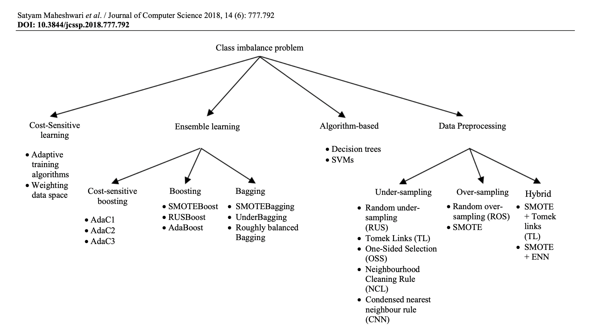
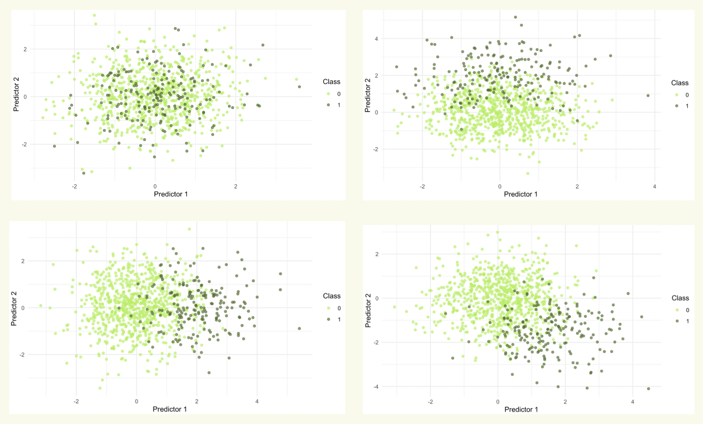
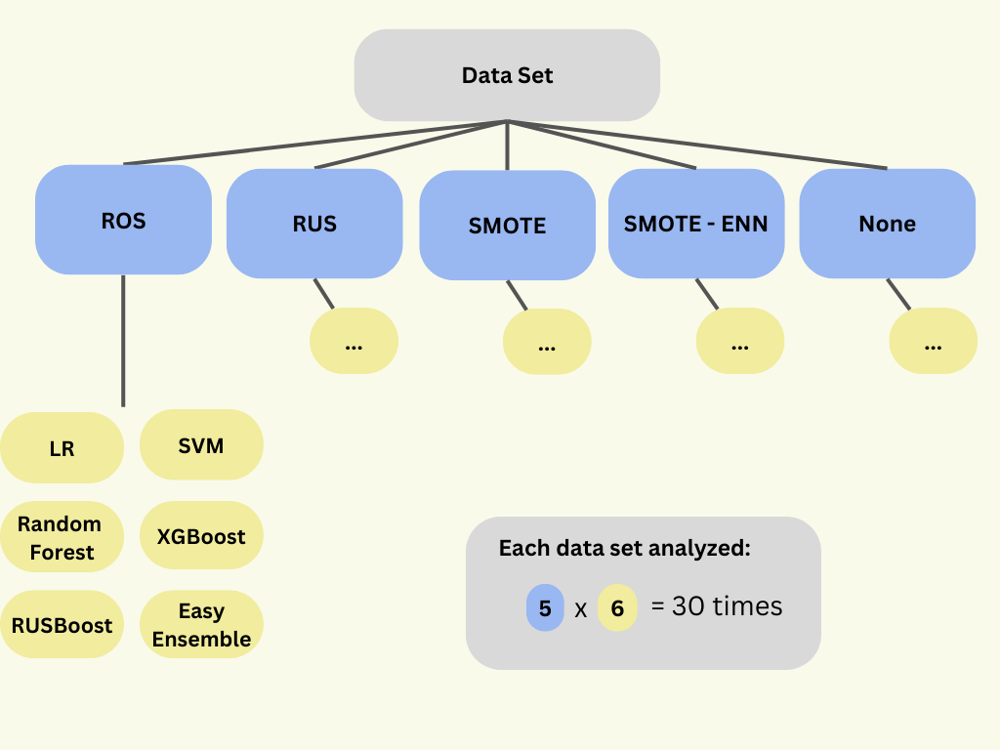

```{r setup, include=FALSE}
knitr::opts_chunk$set(echo = FALSE)
```

## Overview

- Introduction 
- Research Question 
- Simulation Protocol 
    - **A**ims
    - **D**ata generating mechanism
    - **E**stimands
    - **M**ethods
    - **P**erformance metrics
- Discussion / Questions

## Introduction

**Context:** Clinical prediction modelling for dichotomous risk prediction. 

**Problem:** Class Imbalance

\begin{center}
\includegraphics[width= 3.5in,height=3.5in,keepaspectratio]{class_imb.png}
\end{center}

## Introduction 

**Solution:**




## Introduction 

**@ruben results:** 

\begin{center}
\includegraphics[width= 2.25in,height=2.25in,keepaspectratio]{ruben.png}

\textbf{We need to make sure that the cure is not worse than the disease.}
\end{center}

## Research Question 

**Research Question:** Can class imbalance corrections improve the performance of clinical prediction models, without compromising model calibration?\


## Simulation Protocol: Aim

**Aim**: Can class imbalance corrections improve the performance of clinical prediction models, without compromising model calibration?\
\
\

**Building on work of @ruben**: 

- consider variety of classification algorithms 
- consider further imbalance corrections

\
\
**Fair comparison**: to determine which (if any) pair of imbalance correction and classification algorithm can outperform the classification algorithm alone. 

## Simulation Protocol: Data Generating Mechanism 

- We consider 27 (3 x 3 x 3) scenarios, 

  - Number of predictors: 8, 16, 32
  - Event fraction: 0.5, 0.2, 0.02 
  - Sample Size: $\frac{1}{2}N$, $N$, $2N$

where $N$ represents the minimum sample size for the prediction model calculated according to formulae in @riley.\
\

- Data sets will have AUC = 0.85 (SD).

- For each scenario, generate 2000 data sets $\Rightarrow$ 54000 data sets in total.

- Data sets partitioned into test and training data such that training set is 10x larger than the test set.  


## Simulation Protocol: Data Generating Mechanism

**Data Generating Mechanism**: data for each class is generated independently from two distinct *multivariate normal* distributions.\
\
\
\begin{columns}
    \column{0.025\textwidth}
    \column{0.475\textwidth}
        Class 0:
        \begin{itemize}
        \item choose $n_0$
        \item generate predictors $\sim mvn(\mu_0, \Sigma)$
        \end{itemize}
    \column{0.475\textwidth}
        Class 1:
        \begin{itemize}
        \item choose $n_1$
        \item generate predictors $\sim mvn(\mu_1, \Sigma)$
        \end{itemize}
\end{columns}

\vspace{0.5in}

**Why?**

- control event fraction 
- control $\Delta C$ statistic (AUROC)
- not generated under a specific model (i.e., logistic regression)

## Simulation Protocol: Data Generating Mechanism 



**Idea:**  vary parameters ($\mu$ and $\Sigma$) to control overlap of the distributions.

## Simulation Protocol: Estimands

**Estimands**: out-of-sample predictive performance of clinical prediction models for dichotomous risk prediction. 

## Simulation Protocol: Methods

**Full-Factorial Design:** 5 imbalance corrections x 6 classification algorithms: 

**Imbalance Corrections:** all pre-processing techniques

- Random Over Sampling (ROS)
- Random Under Sampling (RUS) 
- Synthetic Minority Oversampling TEchnique (SMOTE)
- SMOTE-Edited Nearest Neighbours (SMOTE-ENN) 
- None 

**Classification Algorithms:** 

  - Logistic Regression 
  - Support Vector Machine 
  - Random Forest 
  - XG Boost 
  - RUSBoost 
  - EasyEnsemble

## Simulation Protocol: Methods



## Simulation Protocol: Performance Metrics

**Performance Metrics:** Out-of sample performance assessed in terms of accuracy, discrimination and calibration. Predictions generated using the test data set.\
\

\begin{columns}
  \column{0.05\textwidth}
  
  \column{0.95\textwidth}
  
\textbf{Accuracy}:
 \begin{itemize}
  \item overall accuracy 
  \item sensitivity 
  \item specificity 
  \item MCC
\end{itemize}

\

\textbf{Discrimination}:
  \begin{itemize}
  \item area under the receiver operator curve ($\Delta$C Statistic)
  \end{itemize}
  
\

\textbf{Calibration}:
  \begin{itemize}
  \item calibration intercept
  \item calibration slope
  \end{itemize}
\end{columns}

## Discussion / Questions

- Under the data generating mechanism chosen, it is unclear how (if possible) to include interaction effects. 

\
\
\
\
\
\
\small
**References**\
\
\tiny

